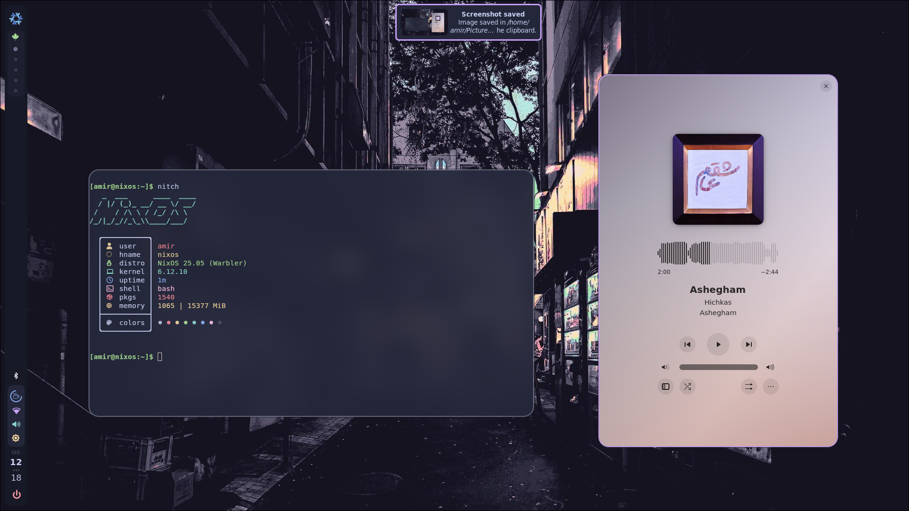

<h3 align="center" >
  🪐 LeftBar setup with <a href="https://hyprland.org/">Hyprland</a> Wm and <a href="https://github.com/elkowar/eww">Eww </a> widgets 💜
</h3>

<p align="center">
	<a href="https://github.com/lackofleak/leftbar-dots/stargazers"></a>
	<a href="https://github.com/lackofleak/leftbar-dots/issues"></a>
</p>

---------------------------------------------------------------------------------------

<h3 align="center"> screenshots and previews </h3>

<details>
  <summary> <h3> 👀 Hyprland, Bar, Dunst and kitty 🐈 </h3></summary>
  
</details>
<details>
  <summary> <h3>👀 wofi drun 📜 </h3></summary>
  
</details>
<details>
  <summary><h3>👀 Hyprlock 🔒</h3></summary>
  
</details>

### installation
> [!WARNING]\
> this files are belong to 1080x1920 monitor, if you have a different resolution or a second monitor you may have a problem.


- let's install :
  
  > please note that the packages names are not same in distros. search for the correct names in your distro when needed. 

  <details>
    <summary> Dependencies list </summary>
    <h4>hyprland with dependencies mentioned in wiki with uwsm</h4>
    <h4>eww with dependencies mentioned in wiki</h4>
    <h4>From Hypr Ecosystem :</h4>
    <p>hyprlock for lockscreen</p>
    <p>hypridle for idle daemon</p>
    <p>hyprshot for scrrenshot</p>
    <p>hyprpaper for wallpapers</p>
    <p>hyprpolkitagent for polkit agent</p>
    <h4>Notifications and menus:</h4>
    <p>dunst</p>
    <p>wofi</p>
    <h4>For clipboard mangement:</h4>
    <p>wl-clipboard</p>
    <p>cliphist</p>
    <h4>For controlling system :</h4>
    <p>brightnessctl</p>
    <p>playerctl</p>
    <p>wpctl - it's also a hyprland dependency(pipewire)</p>
    <p>NetworkManger - for networking</p>
    <h4>For scripts - also mentined in hyprland wiki :</h4>
    <p>awk, stdbuf, grep, seq, socat, jq, and python3</p>
    <h4> and don't forget kitty for terminal :)</h4>
  </details>

- clone this repository :
```bash
git clone https://github.com/lackofleak/leftbar-dots.git
```
- then cd and copy the directories in `~/.config`:
```bash
cd leftbar-dots/config/ && cp -r * ~/.config/
```
- please consider editing hyprpaper config before starting hyprland:
    - you should add your wallpaper path to the file.
```
nano ~/.config/hypr/hyprpaper.conf
```
- all done, lets enter the WM
    - from tty :
    ```bash
    exec uwsm start hyprland-uwsm.desktop
    ```
    - from display manager choose hyprland-uwsm
    - for starting from tty every time you login, add this code to your `.profile`
    ```bash
    if uwsm check may-start; then
        exec uwsm start hyprland-uwsm.desktop
    fi
    ```
- if you have problem using dotfiles, open an issue

> [!NOTE]
> the keybinds are very similar to hyprland's default one
> use `win`+`v` for clipboard
> use `win`+`shift`+`s` for screenshot window
> you can see full list in [here](https://github.com/lackofleak/leftbar-dots/blob/main/config/hypr/hyprland.conf)


if you enjoy this setup, don't forget my star 🌟

<p align="center" > <i> By : lackofleak  </i> </p>
